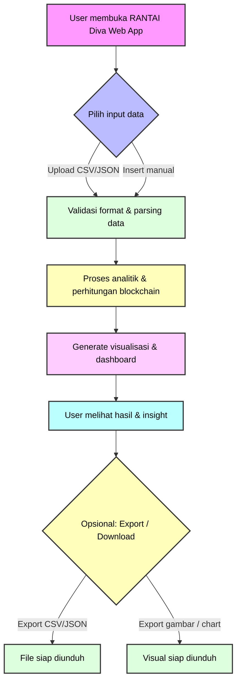

# 💃 RANTAI DIVA — Data Insight & Visualization Assistant

> “Just dance like a real diva should do, and let RANTAI Diva do the work for you.”

---

## 🌟 What is RANTAI DIVA?

RANTAI DIVA (Data Insight & Visualization Assistant) adalah mini app interaktif buat upload CSV/JSON atau input manual data, lalu otomatis:
✅ Visualisasi data (Bar, Line, Pie, Area, Scatter)
✅ AI Data Insights (trend detection, highlight otomatis)
✅ Chart customization sesuai kebutuhan
✅ Super ringan & fun — bukan sekadar BI tool kaku 🎨

---

## 🚀 How It Works

1. Upload file CSV/JSON atau paste manual datamu.

2. Choose chart type → Bar, Line, Pie, Area, Scatter.

3. Enjoy the insights → AI langsung kasih highlight tren dan anomali.

4. Dance like a Diva 💃 → biarin DIVA yang kerjain sisanya.

---

## 🪄 Example Data (CSV)

```csv
Name, Sales, Target
Jan, 12000, 10000
Feb, 15000, 12000
Mar, 9000, 11000
Apr, 17000, 14000
```
Paste aja langsung, chart langsung jadi 🔥

---

## 🎤 Why “DIVA”?

Karena tool ini bukan sekadar another BI tool. DIVA itu:

- Enerjik → bikin chart tanpa ribet.

- Catchy → AI insights otomatis.

- Playful → tagline dan experience fun.

---

## 🔄 Workflow



---

## 🧑‍💻 Credits

Made with ❤️ by RANTAI (KOLABORAKSI)

> Where fun meets innovation.
